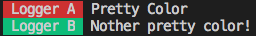

# aurelia-logging-color

[![NPM version][npm-image]][npm-url]
[![NPM downloads][downloads-image]][downloads-url]
[![Build status][travis-image]][travis-url]
[![Coverage Status][coveralls-image]][coveralls-url]
![badge-size-url]

`ColorAppender` for [`aurelia-logging`](https://github.com/aurelia/logging) and `@unional/logging`.

## Why color

Logging is a great tool. But it is also heavily underutilized.
One major reason is that when we log a lot of stuff, we can quickly get overwhelmed by all those information.

`aurelia-logging` allows you to create different loggers for different part of your application, as fine grain as you wanted.

However, it still does not solve the issue above.

Coloring the log message helps you to pick the relevant information much easier.

## Usage

```ts
import { addAppender, setLevel, getLogger, logLevel } from 'aurelia-logging' // or '@unional/logging'
import { ColorAppender } from 'aurelia-logging-color'

addAppender(new ColorAppender())

// turn on logging (this example do it globally)
setLevel(logLevel.info)

const loggerA = getLogger('Logger A')

loggerA.warn('Pretty Color')

const loggerB = getLogger('Logger B')

loggerB.info('Nother pretty color!')
```

Gives you:



Note that on windows 8 or below the constructor option is not in effect because there are not many color available.

## dependencies

- [`color-map`](https://github.com/unional/color-map)

[npm-image]: https://img.shields.io/npm/v/aurelia-logging-color.svg?style=flat
[npm-url]: https://npmjs.org/package/aurelia-logging-color
[downloads-image]: https://img.shields.io/npm/dm/aurelia-logging-color.svg?style=flat
[downloads-url]: https://npmjs.org/package/aurelia-logging-color
[travis-image]: https://img.shields.io/travis/unional/logging/master.svg?style=flat
[travis-url]: https://travis-ci.org/unional/logging?branch=master
[coveralls-image]: https://coveralls.io/repos/github/unional/logging/badge.svg
[coveralls-url]: https://coveralls.io/github/unional/logging
[badge-size-url]: http://img.badgesize.io/unional/logging/master/packages/color/dist/aurelia-logging-color.js.svg?label=bundle_size
