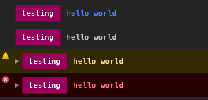
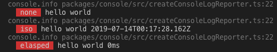

# standard-log-console

[![NPM version][npm-image]][npm-url]
[![NPM downloads][downloads-image]][downloads-url]
![badge-size-url]

[![Circle CI][circleci-image]][circleci-url]
[![Travis CI][travis-image]][travis-url]
[![Codecov][codecov-image]][codecov-url]
[![Coveralls Status][coveralls-image]][coveralls-url]

Console support for [`standard-log`](https://github.com/unional/standard-log).

This is the default reporter of [`standard-log`](https://github.com/unional/standard-log).

## Installation

In normal use case you don't need to reference this library directly.

[`standard-log`](https://github.com/unional/standard-log) exports the main features from `standard-log-console`.

```sh
yarn add standard-log
```

If you want to access other features from `stand-log-console`, you can install it directly:

```sh
yarn add standard-log-console
```

## Usage

By default, [`standard-log`](https://github.com/unional/standard-log) will use this reporter by default.

If you want to configure `standard-log` to use other reporters programatically,
you can use the `createConsoleLogReporter()` to create the reporter for console:

```ts
import {
  createConsoleLogReporter,
  config, // by `standard-log`
} from 'standard-log'

config({ reporters: [createConsoleLogReporter(), /* other reporters */] })
```

By default, it will use ansi formatter in NodeJS and css formatter in browser.

If you want to change that, or use your own formatter:

```ts
import { createConsoleLogReporter } from 'standard-log'

createConsoleLogReporter({
  formatter: yourFormatter
})
```

For `createCssFormatter()`, you can specify how many colors to use:

```ts
import { createCssFormatter } from 'standard-log'

createCssFormatter({ maxColor: 30 })
```


You can also configure the `timestamp` format:

```ts
import { createAnsiFormatter, createCssFormatter } from 'standard-log'

createAnsiFormatter({ timestamp: 'none' })
createAnsiFormatter({ timestamp: 'iso' })
createAnsiFormatter({ timestamp: 'elasped' })

createCssFormatter({ timestamp: 'none' })
createCssFormatter({ timestamp: 'iso' })
createCssFormatter({ timestamp: 'elasped' })
```



[badge-size-url]: http://img.badgesize.io/unional/standard-log/master/packages/console/dist/standard-log-console.js.gz.svg?label=bundle_size
[circleci-image]: https://circleci.com/gh/unional/standard-log/tree/master.svg?style=shield
[circleci-url]: https://circleci.com/gh/unional/standard-log/tree/master
[codecov-image]: https://codecov.io/gh/unional/standard-log/branch/master/graph/badge.svg
[codecov-url]: https://codecov.io/gh/unional/standard-log
[coveralls-image]: https://coveralls.io/repos/github/unional/standard-log/badge.svg
[coveralls-url]: https://coveralls.io/github/unional/standard-log
[downloads-image]: https://img.shields.io/npm/dm/standard-log-console.svg?style=flat
[downloads-url]: https://npmjs.org/package/standard-log-console
[npm-image]: https://img.shields.io/npm/v/standard-log-console.svg?style=flat
[npm-url]: https://www.npmjs.com/package/standard-log-console
[travis-image]: https://img.shields.io/travis/unional/standard-log/master.svg?style=flat
[travis-url]: https://travis-ci.com/unional/standard-log?branch=master
