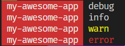

# standard-log

[![NPM version][npm-image]][npm-url]
[![NPM downloads][downloads-image]][downloads-url]

[![GitHub NodeJS][github-nodejs]][github-action-url]
[![Codecov][codecov-image]][codecov-url]

[![Visual Studio Code][vscode-image]][vscode-url]

[standard-log] is a powerful and extensible logging library.

## Key features

- Support micro-app with isolated log system.
- Create multiple loggers for different part of your application.
- Provide multiple log levels out of the box.
- Support custom log levels.
- Three levels of log level controls: log system, logger, and log method.
- Send logs to multiple reporters, e.g. console, file, memory, or remote service.
- Custom formatting and filtering for each reporter.
- Security focus. After the system is created, it cannot be changed.

## Usage

There are two ways to use [standard-log]: global or standalone.

Standalone is the preferred way.
You call `createStandardLog()` to get an isolated log system.

```ts
import { createStandardLog } from 'standard-log'

const standardLog = createStandarLog(/* options */)

const log = standardLog.getLogger('my-app')

log.error('error message')
log.warn('warn message')
log.info('info message')
// by default debug() will not be printed
// because production mode defaults log level to `info`
log.debug('debug message')

// If the message is consume resource to generage,
// you can use `log.on()` so that it will be called only
// if the level is met.
log.on(logLevels.trace, () => prettify(someValue))
```



(above is logged with `standard-log-color`)

You can configure a logger by doing `getLogger(id, options)`:

`options.level: number`:

Log level of this logger.

`options.writeTo: string | RegExp | ((reporterId: string) => boolean)`:

Only log to specific reporter(s).

### Log Level

`standard-log` log level defaults to `logLevels.info`.
It comes with many log levels out of the box:

```ts
log.emergency('msg')
log.alert('msg')
log.critical('msg')
log.error('msg')
log.warn('msg')
log.notice('msg')
log.info('msg')
log.debug('msg')
log.trace('msg')
log.planck('msg')
```

When sending logs to console, they are mapped to `info`, `warn`, `error`, and `debug` based on severity.

You can also add your own custom levels:

```ts
import { createStandardLog } from 'standard-log'

const standardLog = createStandardLog({
  customLevels: {
    'important': logLevel.warn + 1,
    'silly': logLevel.debug + 1
  }
})

const log = standardLog.getLogger('custom')
log.important('this is an important message')
log.silly('oh silly')
```

### Reporters

Besides printing the logs to console,
you can use different reporters to save the logs in memory, file, service, or others.

```ts
import { createStandardLog, createConsoleLogReporter, createMemoryLogReporter } from 'standard-log'

createStandardLog({
  reporters: [createConsoleLogReporter(), createMemoryLogReporter()]
})
```

Some reporters allow you to format the logs and/or filter them.
Using the console log reporter as an example:

```ts
import { createConsoleLogReporter } from 'standard-log'

createConsoleLogReporter({
  formatter: (entry) => [...],
  filter: (entry) => entry.args.every(arg => arg !== 'secret')
})
```

Here are some additional reporters:

- [standard-log-color]
- `standard-log-file` (TODO)
- [standard-log-syslog]

### Suppress log

You can temporarily suppress logs by `suppressLogs()`.
This allows you to disable downstream logs to reduce log noises.

```ts
import { getLogger, suppressLogs } from 'standard-log'

const log = getLogger('some logger')

suppressLogs(() => log.info('not logged'), log)
```

## Testing

During test,
you should use `createStandardLogForTest` which includes a `MemoryReporter` to capture the logs.

```ts
import { createStandardLogForTest } from 'standard-log/testing'

test('your test', () => {
  const standardLog = createStandardLogForTest()
  yourApp.standardLog = standardLog

// do your thing...

  const messages = standardLog.reporter.getLogMessage() // or getLogMessageWithLevel()
  // validate the message if you want to
})
```

## Global usage

You can also call `getLogger()` to get a logger and log away:

```ts
import { getLogger } from 'standard-log'

const log = getLogger('my-lib')
log.info('log away')
```

It internally creates a global instance of `standard-log`.
To configure this global instance, use `configGlobal()`:

```ts
import { configGlobal } from 'standard-log'

configGlobal({ logLevel: logLevels.info, reporters: [ ... ] })
```

This global instance does not support custom levels.
And it will emit a warning when `configGlobal()` is called more than once.
Typically, `configGlobal()` should be called by the application, and it happens only once.
But in micro-app situation, the library can be shared, and each application can call `configGlobal()`

In general, using this global instance should be avoided.
It is the main driving force for 9.0.

[codecov-image]: https://codecov.io/gh/unional/standard-log/branch/master/graph/badge.svg
[codecov-url]: https://codecov.io/gh/unional/standard-log
[downloads-image]: https://img.shields.io/npm/dm/standard-log.svg?style=flat
[downloads-url]: https://npmjs.org/package/standard-log
[github-action-url]: https://github.com/unional/standard-log/actions
[github-nodejs]: https://github.com/unional/standard-log/workflows/release/badge.svg
[npm-image]: https://img.shields.io/npm/v/standard-log.svg?style=flat
[npm-url]: https://www.npmjs.com/package/standard-log
[standard-log-color]: https://github.com/unional/standard-log/tree/master/packages/color
[standard-log-syslog]: https://github.com/unional/standard-log/tree/master/packages/syslog
[standard-log]: https://github.com/unional/standard-log
[vscode-image]: https://img.shields.io/badge/vscode-ready-green.svg
[vscode-url]: https://code.visualstudio.com/
